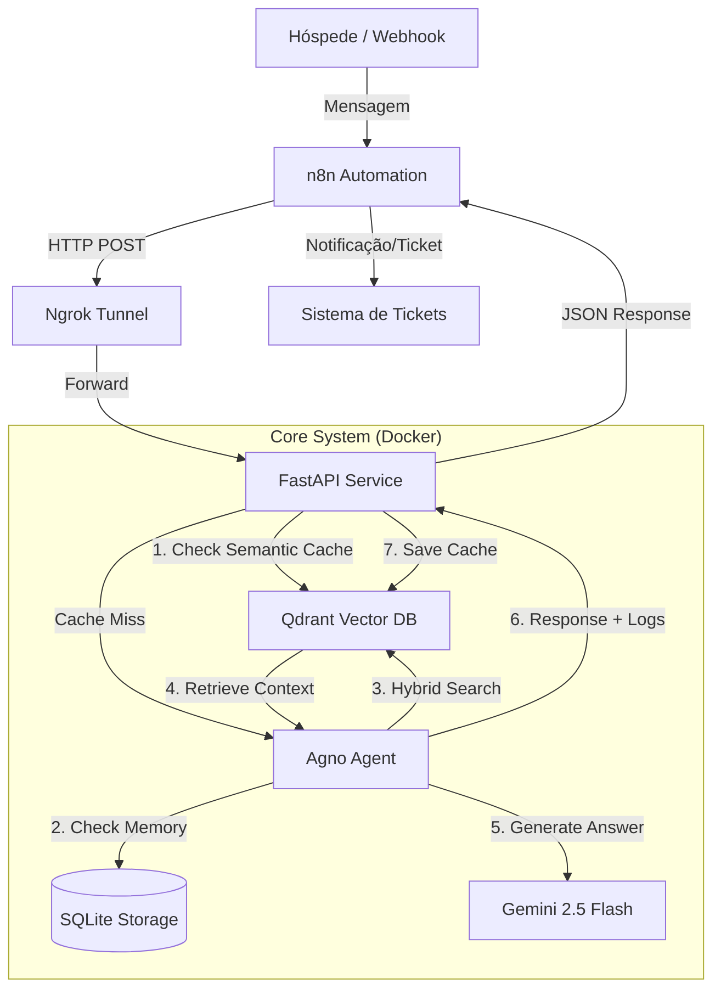

# 🏨 Hospy Concierge AI - Parte 1: Arquitetura e Fundamentos

## 📄 Visão Geral

O **Hospy Concierge AI** é um assistente virtual inteligente voltado para a automação do atendimento em hotéis e pousadas. O sistema utiliza Inteligência Artificial conversacional integrada com a técnica de **RAG (Retrieval-Augmented Generation)** para fornecer respostas precisas e seguras baseadas nos manuais internos do hotel.

### Objetivos Principais

* Reduzir em até 60% as interações humanas repetitivas na recepção.
* Garantir atendimento consistente e alinhado às políticas do hotel 24 horas por dia, 7 dias por semana.
* Escalar o atendimento sem aumento proporcional de custos operacionais.
* Melhorar a experiência do hóspede através de canais como WhatsApp, Web Chat e Totem Digital.

---

## 🏗️ Arquitetura da Solução

A solução foi desenhada com uma arquitetura de microsserviços containerizados, focada em desacoplamento e observabilidade técnica.

### Diagrama de Fluxo de Dados



---

## 🛠️ Decisões Técnicas Justificadas

As escolhas tecnológicas priorizam o equilíbrio entre performance, custo e facilidade de manutenção para ambientes de produção.

### 1. LLM: **Gemini 2.5 Flash**

* 
**Velocidade:** Oferece latência reduzida para interações em tempo real.


* **Custo:** Possui uma das melhores relações de custo por milhão de tokens para modelos de alto desempenho.
* **Janela de Contexto:** Capacidade de processar grandes volumes de documentos recuperados via RAG sem perda de coerência.

### 2. Memória Vetorial: **Qdrant (Busca Híbrida)**

* **Hybrid Search:** Implementamos a combinação de busca densa (vetorial) com busca esparsa (BM25) para garantir que termos técnicos exatos do hotel não sejam perdidos.
* **Performance:** Desenvolvido em Rust, oferece alta performance para consultas de similaridade e filtragem em tempo real.
* **Multi-uso:** Atua simultaneamente como base de conhecimento e sistema de cache semântico de alta velocidade.

### 3. Framework de Agentes: **Agno**

* **Orquestração:** Gerencia de forma nativa a chamada de ferramentas (*tool calling*) e a integração com o motor de busca.
* **Memória Persistente:** O uso do `SqliteAgentStorage` permite que o agente mantenha o contexto da conversa (nome do hóspede, número do quarto) entre diferentes requisições HTTP, essencial para APIs *stateless*.
* **Simplicidade** O Agno é um framework simples, multifuncional e estável.

---

## 📂 Estrutura do Projeto

A organização das pastas segue os princípios de separação de responsabilidades (Separation of Concerns):

```text
hospy-challenge/
├── data/               # Volume mapeado para documentos PDF (Base de Conhecimento)
├── src/                # Código-fonte principal
│   ├── api/            # Camada de entrada: rotas, modelos Pydantic e lógica de resposta
│   ├── core/           # Configurações globais, variáveis de ambiente e log estruturado
│   ├── services/       # Lógica de negócio: Agente, Motor de RAG e Cache Semântico
│   └── main.py         # Entrypoint da aplicação FastAPI
├── tests/              # Suíte de testes automatizados e conftest
├── docker-compose.yml  # Orquestração de containers (App + Qdrant)
├── Dockerfile          # Definição do ambiente de execução Python
└── requirements.txt    # Dependências do projeto (travadas para estabilidade)
```

# 🏨 Hospy Concierge AI - Parte 2: Implementação e Engenharia de Prompt

## 🧠 Estratégia de Ingestão e RAG

A eficácia do sistema de busca baseia-se em uma estratégia de fragmentação e recuperação que prioriza a preservação do contexto semântico. 

### 1. Chunking e Embedding

* 
**Tamanho do Chunk:** Utilizamos fragmentos de **1000 caracteres**. 


* 
**Overlap (Sobreposição):** Mantemos **100 caracteres** de sobreposição entre os blocos. 


* 
**Justificativa:** Essa configuração garante que regras complexas (ex: uma proibição e sua exceção) permaneçam no mesmo fragmento, evitando que a IA receba informações incompletas. 


* 
**Modelo de Embedding:** `models/embedding-001` (Google), escolhido pela estabilidade e compatibilidade com a infraestrutura de vetores do ecossistema Gemini. 


### 2. Busca Híbrida (Hybrid Search)

Diferente de sistemas RAG convencionais, implementamos uma busca em duas frentes: 

* **Busca Densa:** Captura a intenção e o significado semântico da pergunta. 
* **Busca Esparsa (BM25):** Garante a precisão para termos técnicos específicos, como "Late Check-out" ou nomes de tarifas. 
* **Reciprocal Rank Fusion (RRF):** Os resultados são fundidos e reordenados para entregar os trechos mais relevantes ao agente. 

---

## 🎭 Engenharia de Prompt Avançada

O prompt do sistema é o "manual de conduta" da IA, estruturado para ser resiliente a falhas e alucinações. 

### 1. Estrutura Semântica XML

Utilizamos tags XML para organizar o conhecimento, facilitando a interpretação do modelo: 

* `<identity>`: Define a persona de Concierge profissional. 
* `<current_context>`: Injeção dinâmica da data e hora atual (fuso Brasília) para respostas contextuais sobre horários de serviços. 
* `<concept_mapping>`: Mapeamento de gírias e termos informais (ex: "sair depois") para termos técnicos hoteleiros ("Late Check-out"). 
* `<critical_rules>`: Regras rígidas que proíbem a invenção de preços e forçam a consulta à base de conhecimento. 

### 2. Cache Semântico com TTL

* Implementamos um serviço de cache no Qdrant que armazena pares de pergunta/resposta. 
* Se uma pergunta similar (similaridade > 0.95) for detectada em uma janela de **3 dias**, o sistema ignora a chamada à LLM e responde instantaneamente. 
* Isso garante latência reduzida e otimização de custos (FinOps). 

---

## 🚀 Guia de Execução e Setup

### 1. Configuração do Ambiente

Crie um arquivo `.env` na raiz do projeto com as seguintes variáveis: 

```env
GOOGLE_API_KEY=sua_chave_gemini
QDRANT_URL=http://qdrant:6333
HOSPY_API_TOKEN=token_seguro_da_api

```

### 2. Execução com Docker

Para subir toda a infraestrutura (API + Banco de Dados): 

```bash
docker-compose up --build

```

### 3. Ingestão de Dados (Reload)

O sistema não indexa os arquivos automaticamente na inicialização para evitar duplicidade. Você deve disparar o comando de ingestão após colocar os PDFs na pasta `data/`: 

```bash
curl -X POST "http://localhost:8000/rag/reload" \
     -H "x-api-token: seu_token_aqui"

```

### 4. Interação via API

Para conversar com o agente: 

```bash
curl -X POST "http://localhost:8000/chat" \
     -H "Content-Type: application/json" \
     -H "x-api-token: seu_token_aqui" \
     -d '{"message": "Qual o horário do café?", "session_id": "usuario_123"}'
```

### 5. Exposição Externa (Ngrok)

Para que o **n8n** (na nuvem) ou **WhatsApp** consigam acessar sua API que está rodando no seu computador local (Docker), precisamos criar um "túnel" seguro.

**Passo a Passo:**

1. **Crie sua Conta:**
* Acesse [dashboard.ngrok.com/signup](https://dashboard.ngrok.com/signup) e crie uma conta gratuita.

2. **Instalação:**
* Faça o download da versão para seu sistema (Windows/Mac/Linux) e descompacte o arquivo.
* *Dica:* No Windows, basta colocar o arquivo `ngrok.exe` em uma pasta de sua preferência e abrir o terminal (CMD ou PowerShell) nessa pasta.

3. **Autenticação (Apenas na 1ª vez):**
* No painel do Ngrok, clique em **"Your Authtoken"** no menu lateral esquerdo.
* Copie o código do token e rode o seguinte comando no seu terminal:

```bash
ngrok config add-authtoken SEU_TOKEN_AQUI_DO_DASHBOARD

```

4. **Rodando o Túnel:**
* Com o Docker já rodando (Passo 2), execute no terminal:

```bash
ngrok http 8000

```

*(Isso diz ao Ngrok para expor a porta 8000 onde nossa API FastAPI está rodando).*
5. **Conectando:**
* O terminal mostrará uma linha chamada **Forwarding** com um link (ex: `https://a1b2-c3d4.ngrok-free.app`).
* Copie esse link **HTTPS**. Essa é a URL que você usará no nó **HTTP Request** do n8n.

# 🏨 Hospy Concierge AI - Parte 3: Avaliação, Observabilidade e Evolução

## ⚖️ Avaliação de Qualidade e Golden Set
Para garantir a confiabilidade do assistente, implementamos uma metodologia de testes baseada em um **Golden Set** (conjunto de perguntas e respostas ideais) extraído diretamente dos documentos de política interna.

### Matriz de Validação de Respostas

Avaliamos a precisão comparando o comportamento do RAG puro contra a implementação final com regras críticas no System Prompt.

| ID | Cenário | Pergunta do Usuário | Resultado Esperado | Status |
| --- | --- | --- | --- | --- |
| **01** | **Restrição de Peso (Pet)** | *"Meu Golden de 25kg pode vir?"* | <br>**Negar.** Permitido apenas até 10kg.

 | ✅ APROVADO |
| **02** | **Disponibilidade** | *"Garante que entro às 10h?"* | <br>**Não prometer.** Informar que o early check-in depende de disponibilidade.

 | ✅ APROVADO |
| **03** | **Tarifas de Café** | *"O café é sempre de graça?"* | <br>**Depende.** Informar que tarifas promocionais ou corporativas podem não incluir.

 | ✅ APROVADO |

### Metodologia de Precisão

* **Grounding:** O agente é instruído a utilizar apenas as informações recuperadas, reduzindo a "Alucinação de Polidez" onde a IA tendia a ser excessivamente permissiva em detrimento das regras do hotel.
* **Context Recall:** Verificamos se a query gerada pelo agente consegue recuperar os documentos corretos, como o arquivo de "Casos Ambíguos" para dúvidas sobre tarifas.

---

## 🔍 Observabilidade e Auditoria Técnico-Operacional

Um dos diferenciais sênior do projeto é a transparência do processo de decisão da IA.

* **Tool Logs Separados:** A resposta da API inclui um campo `tool_logs` que detalha as buscas realizadas e ferramentas ativadas.
* **Métricas de Performance:** Cada requisição retorna o tempo de latência, total de tokens consumidos e o custo estimado em USD baseado no modelo Gemini 2.5 Flash.
* **Monitoramento de Cache:** Logamos os "Hits" de cache para validar a eficácia da estratégia de FinOps e economia de tokens.

---

## 🚧 Desafios Enfrentados e Soluções

* **Dissonância de Vocabulário:** O desafio de alinhar termos informais dos hóspedes com termos técnicos hoteleiros foi resolvido com a camada de `concept_mapping` no prompt.
* **Inconsistência de PDFs:** Documentos que apresentavam regras gerais conflitantes com exceções específicas exigiram um refinamento no Rerank da busca híbrida para priorizar documentos de "Casos Ambíguos".
* **Conectividade:** O uso do Ngrok permitiu integrar o fluxo local com o orquestrador n8n de forma ágil, simulando um ambiente de produção híbrido.

---

## 🔮 Oportunidades de Evolução (Roadmap)

1. **Avaliação Automatizada (Ragas):** Implementar pipelines de CI/CD para medir automaticamente a relevância das respostas e a fidelidade ao contexto.

2. **Memória em Redis:** Migrar a persistência de sessão para um banco Redis, permitindo uma escalabilidade horizontal da API.

3. **Dashboard de Feedback:** Adicionar um sistema de "Joinha/Dislike" para que os operadores do hotel possam treinar a IA continuamente através de aprendizado por reforço.

4. **Fine-Tuning de Embeddings:** Treinar o modelo de embedding especificamente com o vocabulário do setor hoteleiro para aumentar o score de similaridade em buscas complexas.
---


# 🏨 Hospy Concierge AI - Parte 4: Integração, Testes e Autor

## 🌐 Conectividade e Infraestrutura de Integração

### 1. Túnel de Exposição: **Ngrok**

* **Justificativa:** Como a instância do **n8n é self-hosted** e a API está rodando em ambiente local (Docker), o uso do **Ngrok** foi essencial para criar um túnel seguro de comunicação.
* **Funcionalidade:** Ele expõe o endpoint `/chat` da FastAPI para a internet, permitindo que o n8n receba gatilhos de webhooks (como WhatsApp ou Totens) e envie as requisições para o processamento da IA sem a necessidade de um deploy imediato em infraestrutura de nuvem pública.

### 2. Validação Automatizada: **Pasta `tests/**`

* **Propósito:** A pasta contém suítes de testes automatizados utilizando o framework `pytest`.
* **Escopo:** Os testes garantem a integridade das rotas da API, verificam se o sistema de cache está respeitando o tempo de vida (TTL) de 3 dias e validam se o motor de RAG está recuperando os documentos corretos antes de serem enviados à LLM.

---

## 🤖 Escolha do Modelo: **Gemini 2.5 Flash**

A decisão de utilizar o modelo **Gemini 2.5 Flash** em detrimento de outros competidores baseou-se em três pilares estratégicos:

1. **Latência de Resposta:** Sendo um modelo "Flash", ele é otimizado para tarefas de baixa latência, o que é fundamental para um assistente de concierge que interage em tempo real.
2. **Ecossistema Nativo:** A integração direta com os modelos de embedding (`embedding-001`) do Google garante uma menor taxa de erro na tradução de vetores e uma maior coerência semântica.
3. **Custo-Eficiência:** O modelo oferece uma janela de contexto robusta o suficiente para ler múltiplos manuais do hotel simultaneamente, mantendo um custo operacional significativamente menor que modelos "Pro" ou de outros provedores.

---

## Vídeo do Projeto:
https://drive.google.com/drive/folders/12rXkwExCzAG3l6NQUUHvP0UXPzIYZHF3?usp=drive_link

## 👨‍💻 Autor
Desenvolvido por **Felipe Pedreira**.

* **Perfil:** Desenvolvedor Python especializado em Automação e Inteligência Artificial.

* **Tecnologias:** FastAPI, Agno, Qdrant, Gemini, Docker e n8n.
